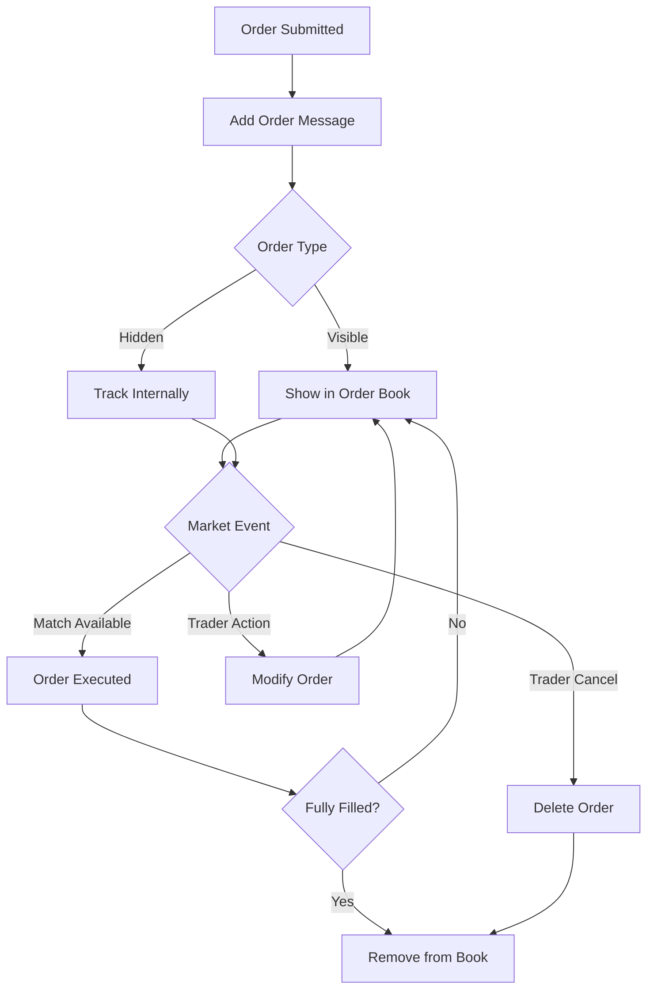

# CBOE PITCH Protocol - Tài liệu Hoàn chỉnh

## Mục lục

1. [Tổng quan Business](#1-tổng-quan-business)
2. [Giới thiệu PITCH Protocol](#2-giới-thiệu-pitch-protocol)
3. [Kiến trúc Hệ thống](#3-kiến-trúc-hệ-thống)
4. [Chi tiết Message Types](#4-chi-tiết-message-types)
5. [Order Book Management](#5-order-book-management)
6. [Kiến trúc Code](#6-kiến-trúc-code)
7. [Vận hành và Monitoring](#7-vận-hành-và-monitoring)
8. [Troubleshooting](#8-troubleshooting)
9. [Performance và Optimization](#9-performance-và-optimization)
10. [Bảo mật và Compliance](#10-bảo-mật-và-compliance)

---

## 1. Tổng quan Business

### 1.1 Thị trường Chứng khoán là gì?

Thị trường chứng khoán là nơi giao dịch mua bán cổ phiếu của các công ty. Khi bạn mua cổ phiếu, bạn trở thành cổ đông và có quyền sở hữu một phần công ty đó.

**Ví dụ đơn giản:**
- Công ty ABC niêm yết 1 triệu cổ phiếu trên sàn
- Bạn muốn mua 1000 cổ phiếu với giá 10.00 AUD/cổ phiếu
- Ai đó khác muốn bán 1000 cổ phiếu với giá 10.00 AUD/cổ phiếu
- Sàn giao dịch sẽ ghép lệnh và thực hiện giao dịch

### 1.2 CBOE Australia (CXA)

**CBOE (Chicago Board Options Exchange)** là một trong những sàn giao dịch lớn nhất thế giới. **CBOE Australia** là chi nhánh tại Úc, cung cấp:

- **Giao dịch cổ phiếu:** Mua bán cổ phiếu các công ty Úc
- **ETF Trading:** Quỹ hoán đổi danh mục đầu tư
- **Warrant Trading:** Quyền chọn mua/bán
- **Market Making:** Tạo thanh khoản cho thị trường

### 1.3 Vai trò của Data Feed

Trong thị trường chứng khoán, **thông tin là sức mạnh**. Các nhà đầu tư cần biết:

- Giá cổ phiếu hiện tại
- Lượng cổ phiếu đang được mua/bán
- Lịch sử giao dịch
- Trạng thái thị trường (mở cửa, đóng cửa, tạm dừng)

**PITCH Protocol** là cách CBOE truyền tải thông tin này đến các:
- **Trading firms:** Công ty môi giới
- **Market makers:** Nhà tạo thị
- **Algorithmic traders:** Trader tự động
- **Data vendors:** Nhà cung cấp dữ liệu tài chính

---

## 2. Giới thiệu PITCH Protocol

### 2.1 PITCH là gì?

**PITCH (Price/Size Information Trading Channel)** là giao thức truyền dữ liệu thời gian thực của CBOE để:

- Truyền tất cả thay đổi trong order book
- Báo cáo mọi giao dịch thực hiện
- Cập nhật trạng thái thị trường
- Cung cấp thông tin auction

### 2.2 Tại sao cần PITCH?

**Vấn đề:** Thị trường chứng khoán có hàng nghìn giao dịch mỗi giây. Làm sao truyền tải thông tin nhanh và chính xác?

**Giải pháp PITCH:**
- **Tốc độ:** Multicast UDP cho độ trễ thấp (< 1ms)
- **Reliability:** TCP backup cho gap recovery
- **Efficiency:** Binary protocol tiết kiệm bandwidth
- **Scalability:** Có thể handle hàng triệu messages/second

### 2.3 So sánh với các giao thức khác

| Giao thức | Tốc độ | Độ tin cậy | Phức tạp | Sử dụng |
|-----------|--------|------------|----------|---------|
| **PITCH** | Rất cao | Cao | Trung bình | Market data real-time |
| **FIX** | Trung bình | Rất cao | Cao | Order management |
| **REST API** | Thấp | Cao | Thấp | Web applications |
| **WebSocket** | Trung bình | Trung bình | Thấp | Retail trading apps |

---

## 3. Kiến trúc Hệ thống

### 3.1 Tổng quan Kiến trúc

```
┌─────────────────┐    ┌─────────────────┐    ┌─────────────────┐
│   CXA Trading   │───▶│  PITCH Gateway  │───▶│   Subscribers   │
│     Engine      │    │                 │    │  (Trading Firms)│
└─────────────────┘    └─────────────────┘    └─────────────────┘
         │                       │                       │
         │              ┌─────────────────┐              │
         │              │  Gap Request    │              │
         └──────────────│    Proxy (GRP)  │◀─────────────┘
                        └─────────────────┘
                                 │
                        ┌─────────────────┐
                        │   Spin Server   │
                        └─────────────────┘
```

### 3.2 Thành phần Hệ thống

#### 3.2.1 Trading Engine
- **Chức năng:** Thực hiện matching orders, quản lý order book
- **Output:** Tạo ra các events (add order, execution, cancel, etc.)
- **Tốc độ:** Xử lý hàng nghìn orders/second

#### 3.2.2 PITCH Gateway
- **Chức năng:** Convert trading events thành PITCH messages
- **Multicast:** Phát sóng real-time data
- **Sequencing:** Đánh số thứ tự cho mọi message

#### 3.2.3 Gap Request Proxy (GRP)
- **Vấn đề:** UDP có thể mất packets
- **Giải pháp:** TCP connection để request lại missing messages
- **Limitation:** Có giới hạn số lượng gap requests

#### 3.2.4 Spin Server
- **Vấn đề:** Nếu miss quá nhiều messages, gap request không đủ
- **Giải pháp:** Snapshot toàn bộ order book tại một thời điểm
- **Sử dụng:** Recovery sau downtime dài

### 3.3 Network Configuration

#### 3.3.1 Multicast Feeds

| Feed | Location | Purpose | Redundancy |
|------|----------|---------|------------|
| **Feed A** | Primary DC | Real-time data | Primary |
| **Feed B** | Primary DC | Real-time data | Secondary |
| **Feed E** | Secondary DC | Real-time data | DR |

#### 3.3.2 Unit Distribution

**Unit:** Chia nhỏ symbols để phân tán tải

| Unit | Symbol Range | Ví dụ |
|------|--------------|-------|
| **Unit 1** | A - M | ANZ, BHP, CBA, FMG |
| **Unit 2** | N - Z | NAB, QAN, WBC, XRO |

### 3.4 Message Flow

```
Trading Event → PITCH Message → Multicast → Subscribers
     ↓               ↓            ↓           ↓
  Order Add    → Add Order   → UDP Packet → Parser
  Execution    → Trade       → UDP Packet → Order Book
  Cancel       → Delete      → UDP Packet → Application
```

---

## 4. Chi tiết Message Types

### 4.1 Danh sách Đầy đủ Message Types

| Message Type | Hex Code | Mục đích | Frequency |
|--------------|----------|----------|-----------|
| **Unit Clear** | 0x97 | Reset unit data | Rare |
| **Trading Status** | 0x3B | Trạng thái giao dịch | Per symbol |
| **Add Order** | 0x37 | Thêm lệnh mới | Very High |
| **Order Executed** | 0x38 | Thực hiện lệnh | High |
| **Order Executed at Price** | 0x58 | Thực hiện trong auction | Medium |
| **Reduce Size** | 0x39 | Giảm size lệnh | Medium |
| **Modify Order** | 0x3A | Sửa đổi lệnh | Medium |
| **Delete Order** | 0x3C | Hủy lệnh | High |
| **Trade** | 0x3D | Giao dịch (hidden/off-exchange) | High |
| **Trade Break** | 0x3E | Hủy giao dịch | Low |
| **Calculated Value** | 0xE3 | Giá trị tính toán | Low |
| **End of Session** | 0x2D | Kết thúc phiên | Once/day |
| **Auction Update** | 0x59 | Cập nhật auction | Medium |
| **Auction Summary** | 0x5A | Kết quả auction | Medium |

### 4.2 Chi tiết từng Message Type

#### 4.2.1 Unit Clear (0x97)
```rust
struct UnitClear {
    length: u8,      // 6 bytes
    type: u8,        // 0x97
    reserved: [u8; 4] // Không sử dụng
}
```

**Mục đích:** Reset toàn bộ order book của một unit
**Khi nào:** Failover datacenter, system restart
**Action:** Clear tất cả orders trong memory

#### 4.2.2 Trading Status (0x3B)
```rust
struct TradingStatus {
    length: u8,           // 22 bytes
    type: u8,             // 0x3B
    timestamp: u64,       // Nanoseconds since epoch
    symbol: [u8; 6],      // Symbol name (space padded)
    trading_status: u8,   // Status code
    market_id_code: [u8; 4], // Market identifier
    reserved: u8
}
```

**Trading Status Values:**
- **'C' - Closed:** Không chấp nhận lệnh, không giao dịch
- **'A' - Pre-market:** Chấp nhận off-exchange reports
- **'T' - Trading:** Giao dịch bình thường
- **'M' - MOC Trading:** Chỉ chấp nhận Market-on-Close orders
- **'P' - Post-market:** Chỉ off-exchange reports
- **'H' - Halted:** Tạm dừng giao dịch (có thể cancel orders)
- **'S' - Trading Suspended:** Suspend dài hạn
- **'O' - Pre-Open:** Chuẩn bị auction mở cửa
- **'E' - Pre-Close:** Chuẩn bị auction đóng cửa

#### 4.2.3 Add Order (0x37)
```rust
struct AddOrder {
    length: u8,        // 42 bytes
    type: u8,          // 0x37
    timestamp: u64,    // Nanoseconds since epoch
    order_id: u64,     // Unique order identifier
    side: u8,          // 'B' = Buy, 'S' = Sell
    quantity: u32,     // Number of shares
    symbol: [u8; 6],   // Symbol name
    price: u64,        // Price (7 decimal places)
    pid: [u8; 4],      // Participant ID
    reserved: u8
}
```

**Lưu ý đặc biệt:**
- **Undisclosed orders:** quantity = 0 (hidden quantity)
- **Iceberg orders:** Chỉ hiển thị display quantity
- **Order ID:** Convert to base36 để match với FIX/BOE

#### 4.2.4 Order Executed (0x38)
```rust
struct OrderExecuted {
    length: u8,           // 43 bytes
    type: u8,             // 0x38
    timestamp: u64,       // Execution time
    order_id: u64,        // Order being executed
    executed_quantity: u32, // Shares executed
    execution_id: u64,    // Unique execution ID
    contra_order_id: u64, // Matching order ID
    contra_pid: [u8; 4],  // Contra participant
    reserved: u8
}
```

**Business Logic:**
- Giảm quantity của order
- Nếu quantity = 0 → order fully filled
- Execution price = order price (từ Add Order)

#### 4.2.5 Order Executed at Price (0x58)
```rust
struct OrderExecutedAtPrice {
    length: u8,           // 52 bytes
    type: u8,             // 0x58
    timestamp: u64,       // Execution time
    order_id: u64,        // Order being executed
    executed_quantity: u32, // Shares executed
    execution_id: u64,    // Unique execution ID
    contra_order_id: u64, // Matching order ID
    contra_pid: [u8; 4],  // Contra participant
    execution_type: u8,   // 'O'/'C'/'H' auction type
    price: u64,           // Execution price
    reserved: u8
}
```

**Khác biệt với Order Executed:**
- Có execution price (auction price)
- Chỉ dùng trong auction
- Execution Type: 'O' = Opening, 'C' = Closing, 'H' = Halt

#### 4.2.6 Reduce Size (0x39)
```rust
struct ReduceSize {
    length: u8,            // 22 bytes
    type: u8,              // 0x39
    timestamp: u64,        // Event time
    order_id: u64,         // Order to reduce
    cancelled_quantity: u32, // Amount to reduce
}
```

**Scenarios:**
- Partial cancel by trader
- Iceberg order refresh
- System-initiated reduction

#### 4.2.7 Modify Order (0x3A)
```rust
struct ModifyOrder {
    length: u8,      // 31 bytes
    type: u8,        // 0x3A
    timestamp: u64,  // Modification time
    order_id: u64,   // Order to modify
    quantity: u32,   // New quantity
    price: u64,      // New price
    reserved: u8
}
```

**Important:** Modify always loses time priority!

#### 4.2.8 Delete Order (0x3C)
```rust
struct DeleteOrder {
    length: u8,     // 18 bytes
    type: u8,       // 0x3C
    timestamp: u64, // Deletion time
    order_id: u64,  // Order to delete
}
```

**Triggers:**
- Trader cancellation
- Order expiry (GTD orders)
- System cleanup
- Corporate actions

#### 4.2.9 Trade (0x3D)
```rust
struct Trade {
    length: u8,              // 72 bytes
    type: u8,                // 0x3D
    timestamp: u64,          // Trade time
    symbol: [u8; 6],         // Symbol
    quantity: u32,           // Shares traded
    price: u64,              // Trade price
    execution_id: u64,       // Unique execution ID
    order_id: u64,           // Order ID (may be obfuscated)
    contra_order_id: u64,    // Contra order ID
    pid: [u8; 4],            // Participant ID
    contra_pid: [u8; 4],     // Contra participant
    trade_type: u8,          // Trade classification
    trade_designation: u8,   // Trade venue
    trade_report_type: u8,   // Off-exchange type
    trade_transaction_time: u64, // Original trade time
    flags: u8                // Additional flags
}
```

**Trade Types:**
- **'N' - Normal:** Standard matching
- **'B' - Broker Preferenced:** Preferred execution
- **' ' - Off-exchange:** Trade report
- **'O'/'C'/'H' - Auctions:** For undisclosed orders

**Trade Designations:**
- **'C' - CXAC:** Limit orders
- **'P' - CXAP:** Mid-point matching
- **'N' - CXAN:** Near point
- **'F' - CXAF:** Far point
- **'M' - CXAM:** Market-on-Close

#### 4.2.10 Trade Break (0x3E)
```rust
struct TradeBreak {
    length: u8,        // 18 bytes
    type: u8,          // 0x3E
    timestamp: u64,    // Break time
    execution_id: u64, // Execution to break
}
```

**Reasons:**
- Erroneous trade
- System error
- Regulatory requirements

#### 4.2.11 Calculated Value (0xE3)
```rust
struct CalculatedValue {
    length: u8,           // 33 bytes
    type: u8,             // 0xE3
    timestamp: u64,       // Calculation time
    symbol: [u8; 6],      // Symbol/Index
    value_category: u8,   // Value type
    value: u64,           // Calculated value
    value_timestamp: u64, // Value generation time
}
```

**Value Categories:**
- **'1' - Closing Price:** Official closing price
- **'2' - iNAV:** Indicative Net Asset Value (ETF)
- **'3' - Index:** Index values
- **'4' - EOD NAV:** End-of-day NAV from issuer

#### 4.2.12 End of Session (0x2D)
```rust
struct EndOfSession {
    length: u8,      // 6 bytes
    type: u8,        // 0x2D
    reserved: [u8; 4] // Unused
}
```

**Timing:** Sent when unit shuts down
**Action:** Stop expecting new sequenced messages

#### 4.2.13 Auction Update (0x59)
```rust
struct AuctionUpdate {
    length: u8,           // 34 bytes
    type: u8,             // 0x59
    timestamp: u64,       // Update time
    symbol: [u8; 6],      // Symbol
    auction_type: u8,     // 'O'/'C'/'H'
    buy_shares: u32,      // Buy side quantity
    sell_shares: u32,     // Sell side quantity
    indicative_price: u64, // Potential auction price
    reserved: u8
}
```

**Conditions:** Only sent when:
- Overlapping order book exists (bid >= ask)
- Auction parameters change

#### 4.2.14 Auction Summary (0x5A)
```rust
struct AuctionSummary {
    length: u8,      // 30 bytes
    type: u8,        // 0x5A
    timestamp: u64,  // Auction completion time
    symbol: [u8; 6], // Symbol
    auction_type: u8, // 'O'/'C'/'H'
    price: u64,      // Final auction price (0 if no trade)
    shares: u32,     // Total shares executed
    reserved: u8
}
```

**Always sent:** Even if no auction trade occurs

---

## 5. Order Book Management

### 5.1 Order Book Structure

```
                    Order Book cho Symbol "CBA"
┌─────────────────────────────────────────────────────────┐
│                    ASK SIDE (Sell)                      │
├─────────────────────────────────────────────────────────┤
│ Price   │ Qty   │ Orders │ Participant │ Time Priority │
│ 102.05  │ 500   │ 1      │ FIRM1       │ 09:15:23.123  │
│ 102.04  │ 1200  │ 2      │ INST2       │ 09:14:55.456  │
│ 102.03  │ 800   │ 1      │ FIRM3       │ 09:16:12.789  │
├─────────────────────────────────────────────────────────┤
│                      SPREAD: 0.04                      │
├─────────────────────────────────────────────────────────┤
│                    BID SIDE (Buy)                       │
├─────────────────────────────────────────────────────────┤
│ 101.99  │ 1000  │ 1      │ FIRM2       │ 09:15:45.234  │
│ 101.98  │ 600   │ 2      │ INST1       │ 09:14:33.567  │
│ 101.97  │ 300   │ 1      │ FIRM4       │ 09:16:01.890  │
└─────────────────────────────────────────────────────────┘
```

### 5.2 Price-Time Priority

**Rules:**
1. **Price Priority:** Best price gets matched first
2. **Time Priority:** Same price → earlier time gets matched first
3. **Order Size:** Không ảnh hưởng priority

**Ví dụ:**
```
Time: 09:15:00 - Order A: Buy 1000 @ 102.00
Time: 09:15:30 - Order B: Buy 500 @ 102.01  ← Higher price = higher priority
Time: 09:15:45 - Order C: Buy 800 @ 102.00  ← Same price, later time = lower priority

Priority: B → A → C
```

### 5.3 Order Lifecycle



### 5.4 Special Order Types

#### 5.4.1 Iceberg Orders
```
Original Order: Buy 5000 shares @ 102.00, Display 1000

Message Flow:
1. Add Order: qty=1000, price=102.00 (order_id=123)
2. Order Executed: qty=1000 (fully executed)
3. Add Order: qty=1000, price=102.00 (order_id=456) ← New obfuscated ID
4. Order Executed: qty=500 (partially executed)
5. Add Order: qty=500, price=102.00 (order_id=789) ← Replenish remainder
```

#### 5.4.2 Undisclosed Orders
```
Add Order Message: qty=0, side=Buy, price=102.00
→ Order exists but không visible trong order book
→ Executions thông qua Trade messages thay vì Order Executed
```

### 5.5 Auction Process

#### 5.5.1 Pre-Open Auction
```
08:00 - Pre-Open phase starts
08:30 - Order entry allowed, no matching
09:00 - Random end (08:59:00 - 09:02:00)
09:00+ - Auction execution
09:01 - Continuous trading starts
```

#### 5.5.2 Auction Matching Algorithm
```python
def auction_match(buy_orders, sell_orders):
    # 1. Sort orders by price
    buy_orders.sort(key=lambda x: x.price, reverse=True)  # Highest first
    sell_orders.sort(key=lambda x: x.price)  # Lowest first
    
    # 2. Find equilibrium price
    for price in all_possible_prices:
        executable_buys = sum(qty for order in buy_orders if order.price >= price)
        executable_sells = sum(qty for order in sell_orders if order.price <= price)
        
        executable_quantity = min(executable_buys, executable_sells)
        
        # 3. Maximize volume, minimize imbalance
        if executable_quantity > best_quantity:
            auction_price = price
            auction_quantity = executable_quantity
```

---

## 6. Kiến trúc Code

### 6.1 Module Structure

```
src/
├── lib.rs              # Public API exports
├── error.rs            # Error handling
├── message.rs          # Message definitions & enums
├── parser.rs           # Binary parsing logic
├── order_book.rs       # Order book simulation
├── simulator.rs        # Test data generation
└── main.rs             # Example application
```

### 6.2 Core Types

#### 6.2.1 Price Representation
```rust
// Price with 7 decimal places (CBOE standard)
pub struct Price(pub u64);

impl Price {
    // Convert from decimal (human readable)
    pub fn from_decimal(decimal: f64) -> Self {
        Price((decimal * 10_000_000.0) as u64)
    }
    
    // Convert to decimal for display
    pub fn to_decimal(&self) -> f64 {
        self.0 as f64 / 10_000_000.0
    }
}

// Example: Price::from_decimal(102.1234567) → Price(1021234567)
```

#### 6.2.2 ID Conversion
```rust
// Order IDs are sent as u64, displayed as base36
pub struct OrderId(pub u64);

impl OrderId {
    pub fn to_base36(&self) -> String {
        base36::encode(self.0)
    }
}

// Example: OrderId(1079067412513217551) → "874XH1UZEHOV"
```

### 6.3 Parser Architecture

```rust
pub struct PitchParser {
    buffer: Vec<u8>,      // Incoming byte stream
    position: usize,      // Current parse position
}

impl PitchParser {
    // Add raw data to buffer
    pub fn feed_data(&mut self, data: &[u8]) {
        self.buffer.extend_from_slice(data);
    }
    
    // Parse next complete frame
    pub fn parse_next_frame(&mut self) -> Result<Option<(Header, Vec<Message>)>> {
        // 1. Check if we have enough data for header (8 bytes)
        // 2. Parse header to get frame length and message count
        // 3. Check if we have complete frame
        // 4. Parse individual messages
        // 5. Return parsed frame or None if incomplete
    }
}
```

### 6.4 Order Book Implementation

```rust
pub struct OrderBook {
    symbol: String,
    orders: HashMap<OrderId, OrderBookEntry>,     // All active orders
    bids: BTreeMap<u64, Vec<OrderId>>,           // Price → Order IDs (desc)
    asks: BTreeMap<u64, Vec<OrderId>>,           // Price → Order IDs (asc)
    trading_status: TradingStatus,
}

impl OrderBook {
    pub fn apply_message(&mut self, message: &PitchMessage) {
        match message {
            PitchMessage::AddOrder { order_id, price, quantity, side, .. } => {
                // Add to orders map and price level
            },
            PitchMessage::OrderExecuted { order_id, executed_quantity, .. } => {
                // Reduce quantity or remove if fully filled
            },
            PitchMessage::DeleteOrder { order_id, .. } => {
                // Remove from all structures
            },
            // ... handle other message types
        }
    }
}
```

### 6.5 Error Handling Strategy

```rust
#[derive(Error, Debug)]
pub enum PitchError {
    #[error("Insufficient data: expected {expected}, got {actual}")]
    InsufficientData { expected: usize, actual: usize },
    
    #[error("Invalid message type: {0:#04x}")]
    InvalidMessageType(u8),
    
    #[error("Invalid sequence number: expected {expected}, got {actual}")]
    InvalidSequence { expected: u32, actual: u32 },
    
    #[error("IO error: {0}")]
    Io(#[from] std::io::Error),
}

// Usage in parsing
fn parse_message(&mut self) -> Result<PitchMessage> {
    if self.buffer.len() < 2 {
        return Err(PitchError::InsufficientData { 
            expected: 2, 
            actual: self.buffer.len() 
        });
    }
    // ... continue parsing
}
```

### 6.6 Performance Considerations

#### 6.6.1 Memory Management
```rust
// Pre-allocate buffers to avoid allocations in hot path
pub struct Parser {
    buffer: Vec<u8>,
    temp_buffer: Vec<u8>,  // Reuse for parsing
}

// Use object pooling for high-frequency objects
pub struct MessagePool {
    pool: Vec<PitchMessage>,
}
```

#### 6.6.2 Zero-Copy Parsing
```rust
// Parse directly from byte slice without copying
fn parse_symbol(data: &[u8; 6]) -> &str {
    // Convert directly without allocation
    std::str::from_utf8(data).unwrap_or("").trim_end()
}
```

---

## 7. Vận hành và Monitoring

### 7.1 Key Metrics

#### 7.1.1 Latency Metrics
```rust
pub struct LatencyStats {
    pub p50_nanos: u64,      // Median latency
    pub p95_nanos: u64,      // 95th percentile  
    pub p99_nanos: u64,      // 99th percentile
    pub max_nanos: u64,      // Maximum latency
}

// Monitor từ message timestamp đến application processing
let processing_latency = Instant::now() - message.timestamp();
```

#### 7.1.2 Throughput Metrics
```rust
pub struct ThroughputStats {
    pub messages_per_second: f64,
    pub bytes_per_second: f64,
    pub peak_mps: f64,
    pub total_messages: u64,
}
```

#### 7.1.3 Gap Statistics
```rust
pub struct GapStats {
    pub total_gaps: u64,
    pub gap_messages_requested: u64,
    pub gap_success_rate: f64,
    pub largest_gap_size: u32,
    pub current_gap_quota: u32,  // Remaining daily quota
}
```

### 7.2 Health Checks

#### 7.2.1 Connection Health
```rust
pub struct ConnectionHealth {
    pub is_connected: bool,
    pub last_heartbeat: DateTime<Utc>,
    pub sequence_gap_detected: bool,
    pub reconnection_count: u32,
}

impl HealthCheck for ConnectionHealth {
    fn is_healthy(&self) -> bool {
        self.is_connected && 
        (Utc::now() - self.last_heartbeat).num_seconds() < 5 &&
        !self.sequence_gap_detected
    }
}
```

#### 7.2.2 Data Quality Checks
```rust
pub fn validate_order_book_integrity(book: &OrderBook) -> Result<(), String> {
    // Check 1: Bid prices should be descending
    let mut prev_bid_price = u64::MAX;
    for (&price, _) in &book.bids {
        if price > prev_bid_price {
            return Err("Bid prices not in descending order".to_string());
        }
        prev_bid_price = price;
    }
    
    // Check 2: Ask prices should be ascending  
    let mut prev_ask_price = 0u64;
    for (&price, _) in &book.asks {
        if price < prev_ask_price {
            return Err("Ask prices not in ascending order".to_string());
        }
        prev_ask_price = price;
    }
    
    // Check 3: Best bid should be <= best ask
    if let (Some(best_bid), Some(best_ask)) = (book.best_bid(), book.best_ask()) {
        if best_bid.0 > best_ask.0 {
            return Err("Crossed market detected".to_string());
        }
    }
    
    Ok(())
}
```

### 7.3 Logging Strategy

#### 7.3.1 Log Levels
```rust
use tracing::{info, warn, error, debug, trace};

// ERROR: Critical failures
error!("Failed to parse message: {:?}", error);

// WARN: Recoverable issues  
warn!("Gap detected: expected {}, got {}", expected, actual);

// INFO: Important events
info!("Trading status changed: {} -> {:?}", symbol, status);

// DEBUG: Detailed flow
debug!("Processed {} messages in {}ms", count, duration);

// TRACE: Very detailed (performance impact)
trace!("Parsing message type: 0x{:02x}", msg_type);
```

#### 7.3.2 Structured Logging
```rust
use serde_json::json;

let log_entry = json!({
    "event": "order_book_update",
    "symbol": order.symbol,
    "order_id": order.order_id.to_base36(),
    "side": order.side,
    "price": order.price.to_decimal(),
    "quantity": order.quantity,
    "timestamp": order.timestamp.to_rfc3339(),
    "latency_nanos": processing_latency.as_nanos()
});

info!("{}", log_entry);
```

### 7.4 Alerting

#### 7.4.1 Critical Alerts
```rust
pub enum AlertLevel {
    Critical,  // Immediate action required
    Warning,   // Monitor closely
    Info,      // Informational
}

pub struct Alert {
    pub level: AlertLevel,
    pub message: String,
    pub context: HashMap<String, String>,
    pub timestamp: DateTime<Utc>,
}

// Critical: Data feed down
if last_message_time + Duration::seconds(10) < Utc::now() {
    send_alert(Alert {
        level: AlertLevel::Critical,
        message: "PITCH data feed disconnected".to_string(),
        context: hashmap!{
            "feed" => "CXA-PITCH-A",
            "last_sequence" => last_sequence.to_string()
        },
        timestamp: Utc::now(),
    });
}

// Warning: High latency
if processing_latency > Duration::milliseconds(100) {
    send_alert(Alert {
        level: AlertLevel::Warning,
        message: "High processing latency detected".to_string(),
        context: hashmap!{
            "latency_ms" => processing_latency.as_millis().to_string()
        },
        timestamp: Utc::now(),
    });
}
```

### 7.5 Configuration Management

#### 7.5.1 Environment-based Config
```rust
#[derive(Debug, Clone)]
pub struct PitchConfig {
    pub primary_feed_address: String,
    pub secondary_feed_address: String,
    pub gap_proxy_address: String,
    pub spin_server_address: String,
    pub buffer_size: usize,
    pub heartbeat_interval: Duration,
    pub gap_request_limit: u32,
    pub log_level: String,
}

impl PitchConfig {
    pub fn from_env() -> Result<Self, ConfigError> {
        Ok(PitchConfig {
            primary_feed_address: env::var("PITCH_PRIMARY_FEED")?,
            secondary_feed_address: env::var("PITCH_SECONDARY_FEED")?,
            gap_proxy_address: env::var("PITCH_GAP_PROXY")?,
            spin_server_address: env::var("PITCH_SPIN_SERVER")?,
            buffer_size: env::var("PITCH_BUFFER_SIZE")?.parse()?,
            heartbeat_interval: Duration::seconds(
                env::var("PITCH_HEARTBEAT_SECS")?.parse()?
            ),
            gap_request_limit: env::var("PITCH_GAP_LIMIT")?.parse()?,
            log_level: env::var("LOG_LEVEL").unwrap_or_else(|_| "info".to_string()),
        })
    }
}
```

---

## 8. Troubleshooting

### 8.1 Common Issues

#### 8.1.1 Sequence Gaps
**Symptoms:**
- Missing sequence numbers
- Order book corruption
- Inconsistent market data

**Diagnosis:**
```rust
fn detect_sequence_gap(expected: u32, received: u32) -> Option<GapInfo> {
    if received != expected {
        Some(GapInfo {
            start_sequence: expected,
            end_sequence: received - 1,
            gap_size: received - expected,
        })
    } else {
        None
    }
}
```

**Solutions:**
1. **Small gaps (< 100 messages):** Use Gap Request Proxy
2. **Large gaps (> 1000 messages):** Request Spin from Spin Server
3. **Persistent gaps:** Check network configuration

#### 8.1.2 Order Book Corruption
**Symptoms:**
- Negative quantities
- Crossed markets (bid > ask)
- Missing orders after execution

**Diagnosis:**
```rust
pub fn diagnose_order_book(book: &OrderBook) -> Vec<DiagnosticIssue> {
    let mut issues = Vec::new();
    
    // Check for negative quantities
    for (order_id, order) in &book.orders {
        if order.quantity == 0 {
            issues.push(DiagnosticIssue::ZeroQuantity(*order_id));
        }
    }
    
    // Check for crossed market
    if let (Some(bid), Some(ask)) = (book.best_bid(), book.best_ask()) {
        if bid.0 > ask.0 {
            issues.push(DiagnosticIssue::CrossedMarket { bid, ask });
        }
    }
    
    // Check for orphaned orders (in price levels but not in orders map)
    for orders_at_level in book.bids.values() {
        for order_id in orders_at_level {
            if !book.orders.contains_key(order_id) {
                issues.push(DiagnosticIssue::OrphanedOrder(*order_id));
            }
        }
    }
    
    issues
}
```

**Solutions:**
1. **Clear and rebuild:** Request fresh spin
2. **Audit trail:** Check message sequence for missing updates
3. **Manual correction:** Remove corrupted orders

#### 8.1.3 High Latency
**Symptoms:**
- Processing delays > 10ms
- Message backlog
- Memory usage increase

**Diagnosis:**
```rust
pub struct PerformanceProfiler {
    parse_times: Vec<Duration>,
    apply_times: Vec<Duration>,
    total_times: Vec<Duration>,
}

impl PerformanceProfiler {
    pub fn profile_message_processing<F>(&mut self, f: F) 
    where F: FnOnce() -> Result<()> 
    {
        let start = Instant::now();
        
        let parse_start = Instant::now();
        let message = self.parse_message()?;
        self.parse_times.push(parse_start.elapsed());
        
        let apply_start = Instant::now();
        self.order_book.apply_message(&message);
        self.apply_times.push(apply_start.elapsed());
        
        self.total_times.push(start.elapsed());
    }
    
    pub fn get_stats(&self) -> PerformanceStats {
        PerformanceStats {
            avg_parse_time: average(&self.parse_times),
            avg_apply_time: average(&self.apply_times),
            avg_total_time: average(&self.total_times),
            p99_total_time: percentile(&self.total_times, 99),
        }
    }
}
```

**Solutions:**
1. **Optimize parsing:** Use zero-copy techniques
2. **Batch processing:** Process multiple messages together
3. **Hardware upgrade:** Faster CPU, more memory
4. **Algorithm optimization:** Better data structures

### 8.2 Debugging Tools

#### 8.2.1 Message Inspector
```rust
pub fn inspect_message(raw_data: &[u8]) -> MessageInspection {
    MessageInspection {
        length: raw_data[0],
        message_type: format!("0x{:02x}", raw_data[1]),
        timestamp: if raw_data.len() > 10 {
            Some(decode_timestamp(&raw_data[2..10]))
        } else {
            None
        },
        raw_hex: hex::encode(raw_data),
        decoded: match parse_message(raw_data) {
            Ok(msg) => Some(format!("{:?}", msg)),
            Err(e) => None,
        },
    }
}
```

#### 8.2.2 Order Book Visualizer
```rust
pub fn visualize_order_book(book: &OrderBook, levels: usize) -> String {
    let (bids, asks) = book.get_level_info(levels);
    let mut output = String::new();
    
    output.push_str(&format!("Order Book for {}\n", book.symbol()));
    output.push_str("─".repeat(50));
    output.push_str("\n");
    
    // Show asks (highest first)
    for (price, qty) in asks.iter().rev() {
        output.push_str(&format!("ASK: {:>10} @ {:>8}\n", qty, price));
    }
    
    output.push_str("─".repeat(50));
    output.push_str(&format!("\nSpread: {:?}\n", book.spread()));
    output.push_str("─".repeat(50));
    output.push_str("\n");
    
    // Show bids (highest first)
    for (price, qty) in &bids {
        output.push_str(&format!("BID: {:>10} @ {:>8}\n", qty, price));
    }
    
    output
}
```

#### 8.2.3 Packet Capture Analysis
```bash
# Capture multicast traffic
sudo tcpdump -i eth0 -w pitch_capture.pcap host 233.218.133.80

# Analyze with custom tool
cargo run --bin pitch_analyzer -- --file pitch_capture.pcap
```

### 8.3 Recovery Procedures

#### 8.3.1 Gap Recovery
```rust
pub async fn recover_gap(
    gap_proxy: &mut GapProxy,
    unit: u8,
    start_seq: u32,
    count: u16
) -> Result<Vec<PitchMessage>> {
    // 1. Send gap request
    let request = GapRequest {
        unit,
        sequence: start_seq,
        count,
    };
    
    gap_proxy.send_request(request).await?;
    
    // 2. Wait for response
    let response = gap_proxy.receive_response().await?;
    
    match response.status {
        'A' => {
            // 3. Collect messages from multicast
            let messages = gap_proxy.collect_gap_messages(
                start_seq, 
                count,
                Duration::seconds(30)  // Timeout
            ).await?;
            
            Ok(messages)
        },
        'O' => Err(PitchError::OutOfRange),
        'D' => Err(PitchError::DailyQuotaExhausted),
        _ => Err(PitchError::GapRequestRejected(response.status)),
    }
}
```

#### 8.3.2 Full Recovery (Spin)
```rust
pub async fn full_recovery(
    spin_server: &mut SpinServer,
    unit: u8
) -> Result<OrderBook> {
    // 1. Login to spin server
    spin_server.login().await?;
    
    // 2. Wait for spin image available
    let spin_image = spin_server.wait_for_spin_image().await?;
    
    // 3. Request spin
    let request = SpinRequest {
        sequence: spin_image.sequence,
    };
    
    spin_server.send_request(request).await?;
    
    // 4. Receive response
    let response = spin_server.receive_response().await?;
    
    if response.status != 'A' {
        return Err(PitchError::SpinRequestRejected(response.status));
    }
    
    // 5. Build order book from spin messages
    let mut order_book = OrderBook::new("".to_string());
    
    let messages = spin_server.receive_spin_messages(
        response.order_count as usize
    ).await?;
    
    for message in messages {
        order_book.apply_message(&message);
    }
    
    // 6. Wait for spin finished
    spin_server.wait_for_spin_finished().await?;
    
    Ok(order_book)
}
```

---

## 9. Performance và Optimization

### 9.1 Latency Optimization

#### 9.1.1 Network Optimizations
```rust
// Configure socket for low latency
pub fn configure_low_latency_socket(socket: &UdpSocket) -> Result<()> {
    // Increase receive buffer
    socket.set_recv_buffer_size(1024 * 1024)?;  // 1MB
    
    // Set socket priority (Linux)
    #[cfg(target_os = "linux")]
    {
        use std::os::unix::io::AsRawFd;
        unsafe {
            let fd = socket.as_raw_fd();
            let priority: libc::c_int = 6;  // High priority
            libc::setsockopt(
                fd,
                libc::SOL_SOCKET,
                libc::SO_PRIORITY,
                &priority as *const _ as *const libc::c_void,
                std::mem::size_of::<libc::c_int>() as libc::socklen_t,
            );
        }
    }
    
    Ok(())
}
```

#### 9.1.2 CPU Affinity
```rust
// Pin threads to specific CPU cores
pub fn set_cpu_affinity(core_id: usize) -> Result<()> {
    #[cfg(target_os = "linux")]
    {
        use libc::{cpu_set_t, sched_setaffinity, CPU_SET, CPU_ZERO};
        
        unsafe {
            let mut cpuset: cpu_set_t = std::mem::zeroed();
            CPU_ZERO(&mut cpuset);
            CPU_SET(core_id, &mut cpuset);
            
            let result = sched_setaffinity(
                0,  // Current thread
                std::mem::size_of::<cpu_set_t>(),
                &cpuset,
            );
            
            if result != 0 {
                return Err(PitchError::SystemError("Failed to set CPU affinity".into()));
            }
        }
    }
    
    Ok(())
}
```

#### 9.1.3 Memory Pool
```rust
pub struct MessagePool {
    pool: Vec<Box<PitchMessage>>,
    in_use: Vec<Box<PitchMessage>>,
}

impl MessagePool {
    pub fn new(capacity: usize) -> Self {
        let mut pool = Vec::with_capacity(capacity);
        for _ in 0..capacity {
            pool.push(Box::new(PitchMessage::default()));
        }
        
        Self {
            pool,
            in_use: Vec::new(),
        }
    }
    
    pub fn acquire(&mut self) -> Option<Box<PitchMessage>> {
        self.pool.pop()
    }
    
    pub fn release(&mut self, message: Box<PitchMessage>) {
        self.pool.push(message);
    }
}
```

### 9.2 Throughput Optimization

#### 9.2.1 Batch Processing
```rust
pub struct BatchProcessor {
    batch_size: usize,
    batch_timeout: Duration,
    pending_messages: Vec<PitchMessage>,
    last_flush: Instant,
}

impl BatchProcessor {
    pub fn add_message(&mut self, message: PitchMessage) -> Option<Vec<PitchMessage>> {
        self.pending_messages.push(message);
        
        // Flush if batch is full or timeout reached
        if self.pending_messages.len() >= self.batch_size ||
           self.last_flush.elapsed() >= self.batch_timeout {
            return Some(self.flush());
        }
        
        None
    }
    
    fn flush(&mut self) -> Vec<PitchMessage> {
        let batch = std::mem::replace(&mut self.pending_messages, Vec::new());
        self.last_flush = Instant::now();
        batch
    }
}
```

#### 9.2.2 Lock-free Data Structures
```rust
use crossbeam::queue::SegQueue;

pub struct LockFreeOrderBook {
    orders: DashMap<OrderId, OrderBookEntry>,  // Concurrent HashMap
    bid_updates: SegQueue<PriceUpdate>,        // Lock-free queue
    ask_updates: SegQueue<PriceUpdate>,
}

impl LockFreeOrderBook {
    pub fn apply_update(&self, update: OrderUpdate) {
        match update.side {
            Side::Buy => self.bid_updates.push(PriceUpdate::from(update)),
            Side::Sell => self.ask_updates.push(PriceUpdate::from(update)),
        }
    }
    
    pub fn process_updates(&self) {
        // Process all pending updates in batch
        while let Some(update) = self.bid_updates.pop() {
            self.apply_bid_update(update);
        }
        
        while let Some(update) = self.ask_updates.pop() {
            self.apply_ask_update(update);
        }
    }
}
```

### 9.3 Memory Optimization

#### 9.3.1 Custom Allocators
```rust
use bumpalo::Bump;

pub struct ArenaAllocatedParser<'a> {
    arena: &'a Bump,
    buffer: &'a mut Vec<u8>,
}

impl<'a> ArenaAllocatedParser<'a> {
    // Allocate strings in arena to avoid heap allocation
    fn parse_symbol(&self, data: &[u8; 6]) -> &'a str {
        let symbol_str = std::str::from_utf8(data).unwrap_or("").trim_end();
        self.arena.alloc_str(symbol_str)
    }
}
```

#### 9.3.2 Compact Data Structures
```rust
// Use bit packing for flags and small enums
#[repr(packed)]
pub struct CompactOrderEntry {
    pub order_id: u64,
    pub price: u64,
    pub quantity: u32,
    pub flags: u8,  // Side (1 bit) + Other flags (7 bits)
}

impl CompactOrderEntry {
    pub fn side(&self) -> Side {
        if self.flags & 0x01 == 0 {
            Side::Buy
        } else {
            Side::Sell
        }
    }
    
    pub fn set_side(&mut self, side: Side) {
        match side {
            Side::Buy => self.flags &= !0x01,
            Side::Sell => self.flags |= 0x01,
        }
    }
}
```

### 9.4 Benchmarking

#### 9.4.1 Microbenchmarks
```rust
use criterion::{black_box, criterion_group, criterion_main, Criterion};

fn benchmark_message_parsing(c: &mut Criterion) {
    let sample_data = generate_sample_message();
    
    c.bench_function("parse_add_order", |b| {
        b.iter(|| {
            let mut parser = PitchParser::new();
            parser.feed_data(black_box(&sample_data));
            black_box(parser.parse_next_frame().unwrap())
        })
    });
}

fn benchmark_order_book_update(c: &mut Criterion) {
    let mut order_book = OrderBook::new("TEST".to_string());
    let add_order = create_sample_add_order();
    
    c.bench_function("apply_add_order", |b| {
        b.iter(|| {
            black_box(order_book.apply_message(black_box(&add_order)))
        })
    });
}

criterion_group!(benches, benchmark_message_parsing, benchmark_order_book_update);
criterion_main!(benches);
```

#### 9.4.2 Load Testing
```rust
pub async fn load_test_parser(
    messages_per_second: u64,
    duration: Duration,
) -> Result<LoadTestResults> {
    let mut parser = PitchParser::new();
    let mut stats = LoadTestStats::new();
    
    let interval = Duration::from_nanos(1_000_000_000 / messages_per_second);
    let end_time = Instant::now() + duration;
    
    while Instant::now() < end_time {
        let start = Instant::now();
        
        // Generate and parse message
        let message_data = generate_random_message();
        parser.feed_data(&message_data);
        
        if let Some((header, messages)) = parser.parse_next_frame()? {
            stats.messages_processed += messages.len() as u64;
        }
        
        stats.total_latency += start.elapsed();
        stats.iterations += 1;
        
        // Rate limiting
        if let Some(sleep_time) = interval.checked_sub(start.elapsed()) {
            tokio::time::sleep(sleep_time).await;
        }
    }
    
    Ok(LoadTestResults {
        avg_latency: stats.total_latency / stats.iterations,
        messages_per_second: stats.messages_processed as f64 / duration.as_secs_f64(),
        peak_memory: get_peak_memory_usage(),
    })
}
```

---

## 10. Bảo mật và Compliance

### 10.1 Bảo mật Network

#### 10.1.1 Multicast Security
```rust
// Validate multicast source
pub fn validate_multicast_source(src_addr: &SocketAddr) -> bool {
    // Only accept from known CBOE servers
    let allowed_sources = [
        "74.115.128.10".parse().unwrap(),
        "74.115.128.11".parse().unwrap(),
        "74.115.128.13".parse().unwrap(),
    ];
    
    allowed_sources.contains(&src_addr.ip())
}

// Implement rate limiting to prevent DoS
pub struct RateLimiter {
    max_messages_per_second: u64,
    window_start: Instant,
    message_count: u64,
}

impl RateLimiter {
    pub fn check_rate_limit(&mut self) -> bool {
        let now = Instant::now();
        
        // Reset window if needed
        if now.duration_since(self.window_start) >= Duration::from_secs(1) {
            self.window_start = now;
            self.message_count = 0;
        }
        
        self.message_count += 1;
        self.message_count <= self.max_messages_per_second
    }
}
```

#### 10.1.2 Data Integrity
```rust
// Implement message authentication
pub fn verify_message_integrity(
    message: &[u8],
    expected_checksum: u32
) -> Result<()> {
    let calculated_checksum = crc32::checksum_ieee(message);
    
    if calculated_checksum != expected_checksum {
        return Err(PitchError::ChecksumMismatch {
            expected: expected_checksum,
            calculated: calculated_checksum,
        });
    }
    
    Ok(())
}

// Sequence validation to detect replay attacks
pub struct SequenceValidator {
    last_sequence: u32,
    unit: u8,
}

impl SequenceValidator {
    pub fn validate_sequence(&mut self, sequence: u32) -> Result<()> {
        if sequence <= self.last_sequence {
            return Err(PitchError::InvalidSequence {
                expected: self.last_sequence + 1,
                actual: sequence,
            });
        }
        
        self.last_sequence = sequence;
        Ok(())
    }
}
```

### 10.2 Data Privacy

#### 10.2.1 Sensitive Data Handling
```rust
// Mask sensitive information in logs
pub fn mask_participant_id(pid: &str) -> String {
    if pid.len() > 2 {
        format!("{}**", &pid[..2])
    } else {
        "****".to_string()
    }
}

// Secure memory handling for sensitive data
use zeroize::Zeroize;

#[derive(Zeroize)]
pub struct SensitiveOrderData {
    pub participant_id: String,
    pub client_id: String,
}

impl Drop for SensitiveOrderData {
    fn drop(&mut self) {
        self.zeroize();
    }
}
```

#### 10.2.2 Access Control
```rust
pub struct AccessControlManager {
    permissions: HashMap<UserId, Permissions>,
}

#[derive(Debug, Clone)]
pub struct Permissions {
    pub can_view_order_book: bool,
    pub can_view_trade_data: bool,
    pub can_view_participant_data: bool,
    pub symbols_allowed: Vec<String>,
}

impl AccessControlManager {
    pub fn check_permission(
        &self,
        user_id: &UserId,
        action: &Action,
        resource: &Resource,
    ) -> bool {
        if let Some(permissions) = self.permissions.get(user_id) {
            match (action, resource) {
                (Action::ViewOrderBook, Resource::Symbol(symbol)) => {
                    permissions.can_view_order_book &&
                    permissions.symbols_allowed.contains(symbol)
                },
                (Action::ViewTrades, _) => permissions.can_view_trade_data,
                (Action::ViewParticipants, _) => permissions.can_view_participant_data,
                _ => false,
            }
        } else {
            false
        }
    }
}
```

### 10.3 Regulatory Compliance

#### 10.3.1 Audit Trail
```rust
pub struct AuditLogger {
    log_file: File,
    encryption_key: [u8; 32],
}

impl AuditLogger {
    pub fn log_market_event(&mut self, event: &MarketEvent) -> Result<()> {
        let audit_record = AuditRecord {
            timestamp: Utc::now(),
            event_type: event.event_type(),
            symbol: event.symbol().to_string(),
            details: serde_json::to_string(event)?,
            checksum: self.calculate_checksum(event),
        };
        
        // Encrypt sensitive audit data
        let encrypted_record = self.encrypt_record(&audit_record)?;
        
        // Write to tamper-evident log
        writeln!(self.log_file, "{}", 
                 serde_json::to_string(&encrypted_record)?)?;
        
        self.log_file.sync_all()?;  // Force write to disk
        
        Ok(())
    }
    
    fn calculate_checksum(&self, event: &MarketEvent) -> u64 {
        use std::collections::hash_map::DefaultHasher;
        use std::hash::{Hash, Hasher};
        
        let mut hasher = DefaultHasher::new();
        event.hash(&mut hasher);
        hasher.finish()
    }
}
```

#### 10.3.2 Best Execution Monitoring
```rust
pub struct BestExecutionMonitor {
    price_improvements: Vec<PriceImprovement>,
    market_data_quality: MarketDataQuality,
}

#[derive(Debug)]
pub struct PriceImprovement {
    pub timestamp: DateTime<Utc>,
    pub symbol: String,
    pub improvement_amount: Price,
    pub execution_venue: String,
}

impl BestExecutionMonitor {
    pub fn analyze_execution(&mut self, execution: &ExecutionReport) {
        // Check if execution achieved best available price
        let best_bid = self.get_best_bid(&execution.symbol);
        let best_ask = self.get_best_ask(&execution.symbol);
        
        let improvement = match execution.side {
            Side::Buy => {
                if execution.price < best_ask {
                    Some(best_ask - execution.price)
                } else {
                    None
                }
            },
            Side::Sell => {
                if execution.price > best_bid {
                    Some(execution.price - best_bid)
                } else {
                    None
                }
            }
        };
        
        if let Some(improvement_amount) = improvement {
            self.price_improvements.push(PriceImprovement {
                timestamp: execution.timestamp,
                symbol: execution.symbol.clone(),
                improvement_amount,
                execution_venue: execution.venue.clone(),
            });
        }
    }
}
```

### 10.4 Error Handling và Recovery

#### 10.4.1 Circuit Breaker Pattern
```rust
pub struct CircuitBreaker {
    failure_threshold: u32,
    recovery_timeout: Duration,
    current_failures: u32,
    last_failure_time: Option<Instant>,
    state: CircuitState,
}

#[derive(Debug, PartialEq)]
pub enum CircuitState {
    Closed,    // Normal operation
    Open,      // Failures detected, circuit open
    HalfOpen,  // Testing if service recovered
}

impl CircuitBreaker {
    pub fn call<T, E>(&mut self, operation: impl FnOnce() -> Result<T, E>) -> Result<T, CircuitError<E>> {
        match self.state {
            CircuitState::Open => {
                if let Some(last_failure) = self.last_failure_time {
                    if last_failure.elapsed() > self.recovery_timeout {
                        self.state = CircuitState::HalfOpen;
                    } else {
                        return Err(CircuitError::CircuitOpen);
                    }
                }
            },
            CircuitState::HalfOpen | CircuitState::Closed => {},
        }
        
        match operation() {
            Ok(result) => {
                self.on_success();
                Ok(result)
            },
            Err(error) => {
                self.on_failure();
                Err(CircuitError::OperationFailed(error))
            }
        }
    }
    
    fn on_success(&mut self) {
        self.current_failures = 0;
        self.state = CircuitState::Closed;
    }
    
    fn on_failure(&mut self) {
        self.current_failures += 1;
        self.last_failure_time = Some(Instant::now());
        
        if self.current_failures >= self.failure_threshold {
            self.state = CircuitState::Open;
        }
    }
}
```

#### 10.4.2 Graceful Degradation
```rust
pub struct GracefulDegradationManager {
    primary_feed_healthy: bool,
    secondary_feed_healthy: bool,
    cached_order_book: Option<OrderBook>,
    last_update_time: DateTime<Utc>,
}

impl GracefulDegradationManager {
    pub fn get_market_data(&self, symbol: &str) -> Result<MarketData, DegradationError> {
        // Try primary feed first
        if self.primary_feed_healthy {
            return self.get_from_primary_feed(symbol);
        }
        
        // Fallback to secondary feed
        if self.secondary_feed_healthy {
            return self.get_from_secondary_feed(symbol);
        }
        
        // Use cached data with staleness warning
        if let Some(cached_book) = &self.cached_order_book {
            let staleness = Utc::now() - self.last_update_time;
            
            if staleness < Duration::minutes(5) {
                return Ok(MarketData {
                    order_book: cached_book.clone(),
                    staleness_warning: Some(staleness),
                    data_quality: DataQuality::Stale,
                });
            }
        }
        
        Err(DegradationError::NoDataAvailable)
    }
}
```

---

## 11. Deployment và DevOps

### 11.1 Container Configuration

#### 11.1.1 Dockerfile
```dockerfile
# Multi-stage build for optimized production image
FROM rust:1.75 as builder

WORKDIR /usr/src/app
COPY Cargo.toml Cargo.lock ./
COPY src ./src

# Build with optimizations
RUN cargo build --release

FROM debian:bookworm-slim

# Install runtime dependencies
RUN apt-get update && apt-get install -y \
    ca-certificates \
    libssl3 \
    && rm -rf /var/lib/apt/lists/*

# Create non-root user
RUN useradd -r -s /bin/false cboe-pitch

WORKDIR /app

# Copy binary and set permissions
COPY --from=builder /usr/src/app/target/release/cboe-pitch-parser .
RUN chown cboe-pitch:cboe-pitch cboe-pitch-parser && \
    chmod +x cboe-pitch-parser

# Create data directory
RUN mkdir -p /app/data /app/logs && \
    chown -R cboe-pitch:cboe-pitch /app

USER cboe-pitch

# Health check
HEALTHCHECK --interval=30s --timeout=10s --start-period=5s --retries=3 \
  CMD ./cboe-pitch-parser --health-check

EXPOSE 8080
CMD ["./cboe-pitch-parser"]
```

#### 11.1.2 Docker Compose
```yaml
version: '3.8'

services:
  cboe-pitch-parser:
    build: .
    container_name: cboe-pitch-parser
    restart: unless-stopped
    
    environment:
      # Network configuration
      - PITCH_PRIMARY_FEED=233.218.133.80:30501
      - PITCH_SECONDARY_FEED=233.218.133.96:30501
      - PITCH_GAP_PROXY=74.115.128.10:30501
      - PITCH_SPIN_SERVER=74.115.128.10:30601
      
      # Performance tuning
      - PITCH_BUFFER_SIZE=1048576
      - PITCH_HEARTBEAT_SECS=1
      - PITCH_GAP_LIMIT=1000
      
      # Logging
      - LOG_LEVEL=info
      - RUST_LOG=cboe_pitch_parser=debug
      
    volumes:
      - ./data:/app/data
      - ./logs:/app/logs
      - ./config:/app/config:ro
      
    networks:
      - cboe-network
      
    # Resource limits
    deploy:
      resources:
        limits:
          cpus: '2'
          memory: 4G
        reservations:
          cpus: '1'
          memory: 2G
          
    # Security
    security_opt:
      - no-new-privileges:true
    read_only: true
    tmpfs:
      - /tmp:noexec,nosuid,size=100m

  prometheus:
    image: prom/prometheus:latest
    container_name: prometheus
    ports:
      - "9090:9090"
    volumes:
      - ./monitoring/prometheus.yml:/etc/prometheus/prometheus.yml:ro
    networks:
      - cboe-network

  grafana:
    image: grafana/grafana:latest
    container_name: grafana
    ports:
      - "3000:3000"
    environment:
      - GF_SECURITY_ADMIN_PASSWORD=admin
    volumes:
      - grafana-data:/var/lib/grafana
      - ./monitoring/grafana:/etc/grafana/provisioning:ro
    networks:
      - cboe-network

networks:
  cboe-network:
    driver: bridge

volumes:
  grafana-data:
```

### 11.2 Kubernetes Deployment

#### 11.2.1 Deployment Manifest
```yaml
apiVersion: apps/v1
kind: Deployment
metadata:
  name: cboe-pitch-parser
  labels:
    app: cboe-pitch-parser
spec:
  replicas: 2
  selector:
    matchLabels:
      app: cboe-pitch-parser
  template:
    metadata:
      labels:
        app: cboe-pitch-parser
    spec:
      containers:
      - name: cboe-pitch-parser
        image: cboe-pitch-parser:latest
        ports:
        - containerPort: 8080
          name: metrics
        
        env:
        - name: PITCH_PRIMARY_FEED
          valueFrom:
            configMapKeyRef:
              name: cboe-config
              key: primary-feed
        - name: PITCH_SECONDARY_FEED
          valueFrom:
            configMapKeyRef:
              name: cboe-config
              key: secondary-feed
              
        resources:
          requests:
            memory: "2Gi"
            cpu: "1000m"
          limits:
            memory: "4Gi"
            cpu: "2000m"
            
        livenessProbe:
          exec:
            command:
            - ./cboe-pitch-parser
            - --health-check
          initialDelaySeconds: 30
          periodSeconds: 30
          
        readinessProbe:
          httpGet:
            path: /ready
            port: 8080
          initialDelaySeconds: 10
          periodSeconds: 5
          
        # Security context
        securityContext:
          runAsNonRoot: true
          runAsUser: 1000
          allowPrivilegeEscalation: false
          readOnlyRootFilesystem: true
          capabilities:
            drop:
              - ALL
            add:
              - NET_BIND_SERVICE
              
        volumeMounts:
        - name: data-volume
          mountPath: /app/data
        - name: logs-volume
          mountPath: /app/logs
        - name: config-volume
          mountPath: /app/config
          readOnly: true
          
      volumes:
      - name: data-volume
        persistentVolumeClaim:
          claimName: cboe-data-pvc
      - name: logs-volume
        emptyDir: {}
      - name: config-volume
        configMap:
          name: cboe-config
```

### 11.3 Monitoring và Observability

#### 11.3.1 Metrics Collection
```rust
use prometheus::{Counter, Histogram, Gauge, register_counter, register_histogram, register_gauge};

pub struct Metrics {
    pub messages_processed: Counter,
    pub processing_latency: Histogram,
    pub order_book_depth: Gauge,
    pub gap_requests: Counter,
    pub connection_status: Gauge,
}

impl Metrics {
    pub fn new() -> Result<Self, prometheus::Error> {
        Ok(Metrics {
            messages_processed: register_counter!(
                "pitch_messages_processed_total",
                "Total number of PITCH messages processed"
            )?,
            processing_latency: register_histogram!(
                "pitch_processing_latency_seconds",
                "Time spent processing PITCH messages",
                vec![0.001, 0.005, 0.01, 0.05, 0.1, 0.5, 1.0]
            )?,
            order_book_depth: register_gauge!(
                "pitch_order_book_depth",
                "Current order book depth"
            )?,
            gap_requests: register_counter!(
                "pitch_gap_requests_total",
                "Total number of gap requests sent"
            )?,
            connection_status: register_gauge!(
                "pitch_connection_status",
                "Connection status (1=connected, 0=disconnected)"
            )?,
        })
    }
    
    pub fn record_message_processed(&self) {
        self.messages_processed.inc();
    }
    
    pub fn record_processing_latency(&self, duration: Duration) {
        self.processing_latency.observe(duration.as_secs_f64());
    }
}
```

#### 11.3.2 Structured Logging với Tracing
```rust
use tracing::{info, warn, error, instrument};
use tracing_subscriber::{layer::SubscriberExt, util::SubscriberInitExt};

pub fn init_tracing() {
    tracing_subscriber::registry()
        .with(
            tracing_subscriber::EnvFilter::try_from_default_env()
                .unwrap_or_else(|_| "cboe_pitch_parser=debug".into()),
        )
        .with(tracing_subscriber::fmt::layer())
        .with(tracing_jaeger::new_pipeline().install_simple().unwrap())
        .init();
}

#[instrument(skip(parser, order_book))]
pub async fn process_message_batch(
    parser: &mut PitchParser,
    order_book: &mut OrderBook,
    batch_size: usize,
) -> Result<usize> {
    let start = Instant::now();
    let mut processed = 0;
    
    for _ in 0..batch_size {
        if let Some((header, messages)) = parser.parse_next_frame()? {
            for message in messages {
                order_book.apply_message(&message);
                processed += 1;
                
                info!(
                    message_type = %format!("0x{:02x}", message.message_type()),
                    symbol = %message.symbol().unwrap_or("N/A"),
                    "Processed message"
                );
            }
        }
    }
    
    let duration = start.elapsed();
    info!(
        processed_count = processed,
        duration_ms = duration.as_millis(),
        "Completed message batch processing"
    );
    
    Ok(processed)
}
```

### 11.4 CI/CD Pipeline

#### 11.4.1 GitHub Actions
```yaml
name: CI/CD Pipeline

on:
  push:
    branches: [ main, develop ]
  pull_request:
    branches: [ main ]

env:
  CARGO_TERM_COLOR: always

jobs:
  test:
    runs-on: ubuntu-latest
    
    steps:
    - uses: actions/checkout@v4
    
    - name: Install Rust
      uses: actions-rs/toolchain@v1
      with:
        toolchain: stable
        override: true
        components: rustfmt, clippy
        
    - name: Cache dependencies
      uses: actions/cache@v3
      with:
        path: |
          ~/.cargo/registry
          ~/.cargo/git
          target
        key: ${{ runner.os }}-cargo-${{ hashFiles('**/Cargo.lock') }}
        
    - name: Run tests
      run: cargo test --verbose
      
    - name: Run clippy
      run: cargo clippy -- -D warnings
      
    - name: Check formatting
      run: cargo fmt -- --check
      
    - name: Run security audit
      run: |
        cargo install cargo-audit
        cargo audit
        
    - name: Run benchmarks
      run: cargo bench
      
  build:
    needs: test
    runs-on: ubuntu-latest
    
    steps:
    - uses: actions/checkout@v4
    
    - name: Build Docker image
      run: docker build -t cboe-pitch-parser:${{ github.sha }} .
      
    - name: Run security scan
      run: |
        docker run --rm -v /var/run/docker.sock:/var/run/docker.sock \
          -v $HOME/Library/Caches:/root/.cache/ \
          aquasec/trivy image cboe-pitch-parser:${{ github.sha }}
          
    - name: Push to registry
      if: github.ref == 'refs/heads/main'
      run: |
        echo ${{ secrets.DOCKER_PASSWORD }} | docker login -u ${{ secrets.DOCKER_USERNAME }} --password-stdin
        docker push cboe-pitch-parser:${{ github.sha }}
        docker tag cboe-pitch-parser:${{ github.sha }} cboe-pitch-parser:latest
        docker push cboe-pitch-parser:latest
        
  deploy:
    needs: build
    runs-on: ubuntu-latest
    if: github.ref == 'refs/heads/main'
    
    steps:
    - name: Deploy to production
      run: |
        # Update Kubernetes deployment
        kubectl set image deployment/cboe-pitch-parser \
          cboe-pitch-parser=cboe-pitch-parser:${{ github.sha }}
        kubectl rollout status deployment/cboe-pitch-parser
```

---

## 12. Kết luận

### 12.1 Tóm tắt

CBOE PITCH Protocol là một hệ thống phức tạp và quan trọng trong cơ sở hạ tầng tài chính hiện đại. Project Rust này cung cấp:

1. **Parser hoàn chỉnh** cho tất cả 14 message types của PITCH
2. **Order book simulation** real-time với price-time priority
3. **Performance optimization** cho môi trường production
4. **Error handling** robust và recovery mechanisms
5. **Monitoring và observability** đầy đủ
6. **Security và compliance** theo chuẩn tài chính

### 12.2 Best Practices

1. **Performance First:** Luôn prioritize latency và throughput
2. **Data Integrity:** Validate mọi input và maintain audit trail
3. **Fault Tolerance:** Design cho failure scenarios
4. **Monitoring:** Comprehensive metrics và alerting
5. **Security:** Defense in depth approach

### 12.3 Roadmap Phát triển

#### Phase 1: Core Implementation ✅
- [x] Basic message parsing
- [x] Order book management
- [x] Error handling

#### Phase 2: Production Ready 🚧
- [ ] Gap Request Proxy integration
- [ ] Spin Server support
- [ ] Performance optimization
- [ ] Complete test coverage

#### Phase 3: Advanced Features 📋
- [ ] Market data analytics
- [ ] Real-time alerts
- [ ] Machine learning integration
- [ ] Multi-exchange support

### 12.4 Tài liệu Tham khảo

1. **CBOE PITCH Specification v1.0.12** - Official protocol documentation
2. **Rust Performance Book** - Optimization techniques
3. **Financial Markets Infrastructure** - Business context
4. **High-Frequency Trading Systems** - Architecture patterns

---

*Tài liệu này cung cấp framework hoàn chỉnh để hiểu, phát triển và vận hành CBOE PITCH Protocol parser. Với kiến thức này, bất kỳ developer nào cũng có thể maintain và extend hệ thống một cách hiệu quả.*